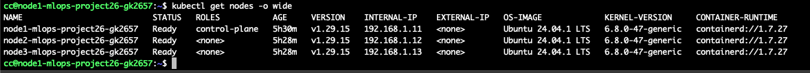
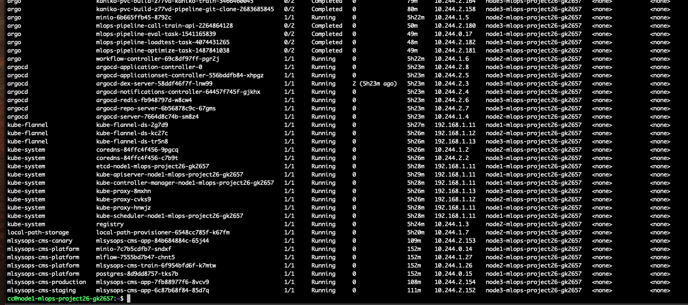
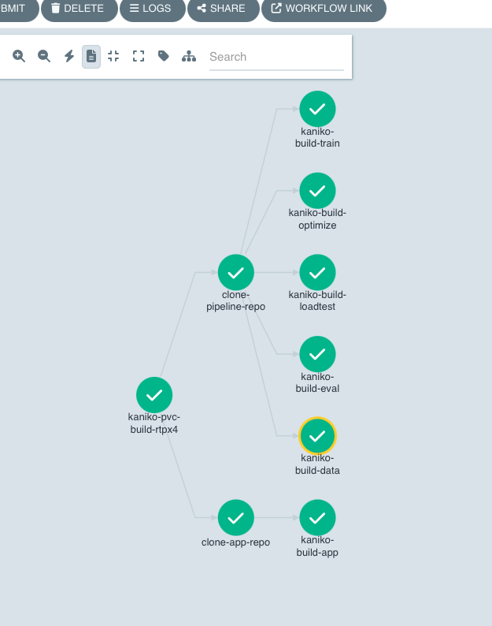
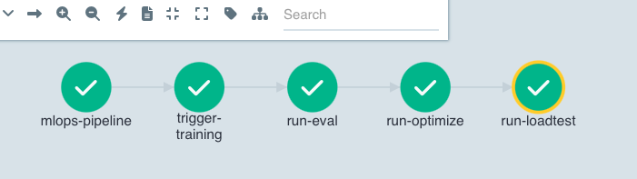
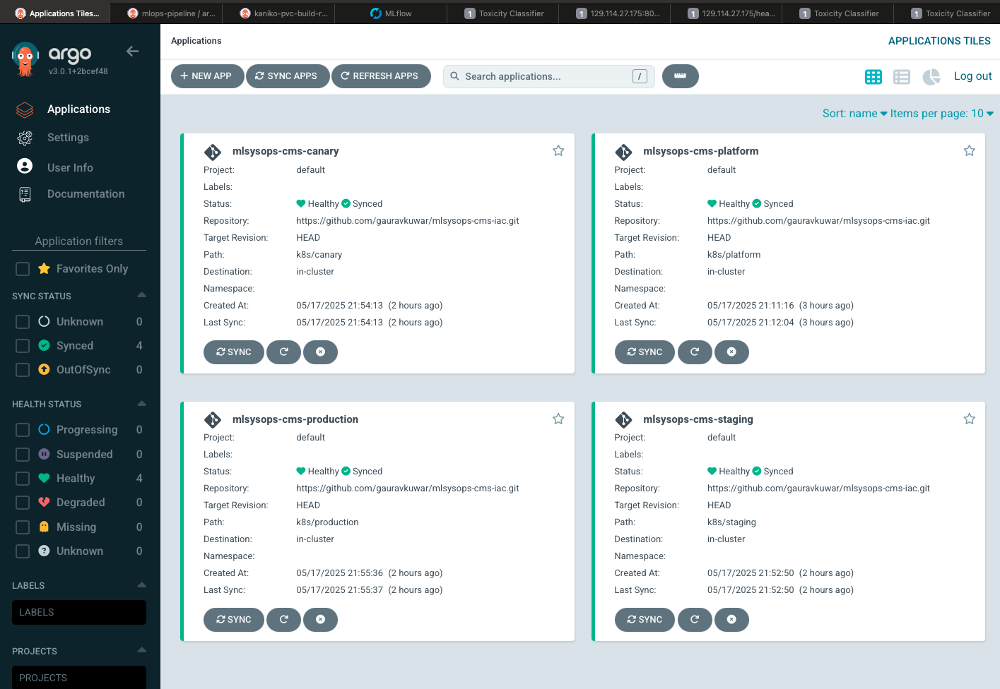
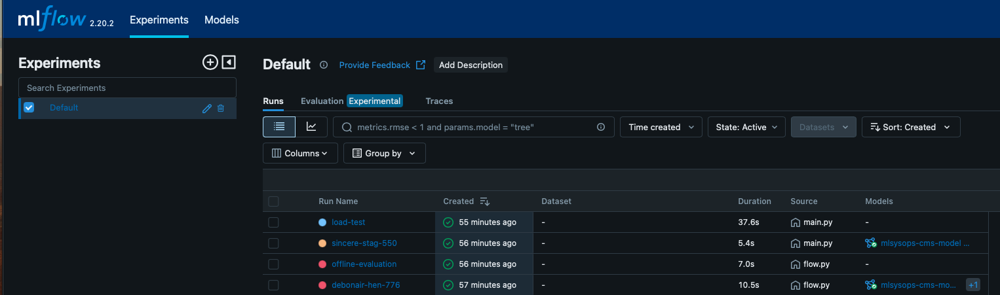
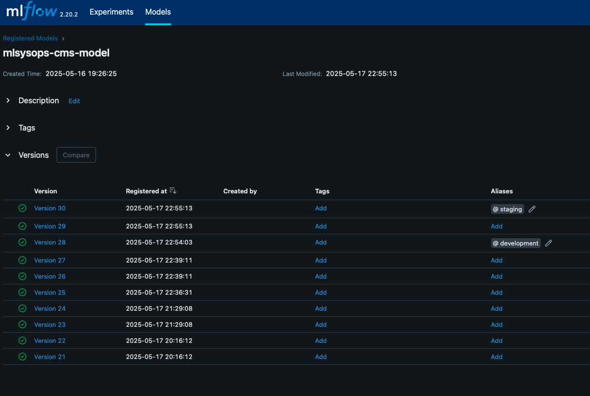
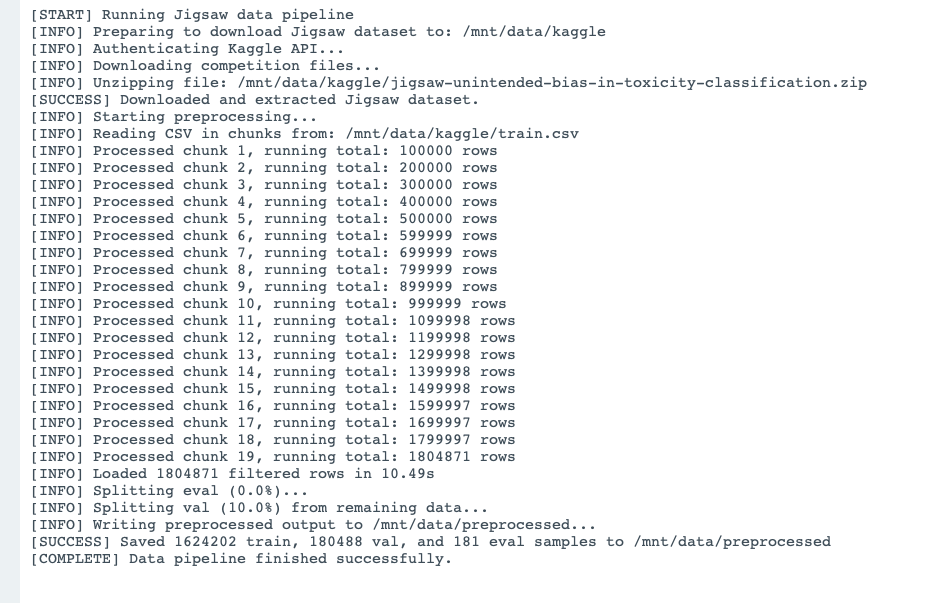

# Machine Learning System Operations - Final Project

## Content Moderation System / Toxicity Classifier

This project builds a complete machine learning system to operationalize a content moderation pipeline using the Jigsaw Toxic Comment Classification dataset. The goal is to not just train a classifier, but build a reproducible, cloud-native ML system with full DevOps, model lifecycle, evaluation, and deployment capabilities.

---

## Cloud Computing

### Infrastructure (Completed)

* **Provisioning:** Terraform provisions 3 `m1.xlarge` instances on ChameleonCloud.
* **Networking:** A private network is created and attached to a shared network, with a floating IP for access.
* **Storage:** A manually created block storage volume is mounted to Node 1 to persist data and artifacts.

### Cloud-Native (Completed)

* **Kubernetes Cluster:**

  * Node 1: Control plane
  * Nodes 2 & 3: Worker nodes
* **Manual Installation:** K8s was installed without KubeSpray to control dependencies manually.
* **Core Services:**

  * Container Registry
  * CoreDNS
  * Local-path-provisioner


**Kubernetes Cluster Nodes**



**Kubernetes Cluster Pods**


---

## DevOps

### Infrastructure as Code (Completed)

* A Jupyter notebook walks through infrastructure setup.
* Ansible configures remote instances post-Terraform.

### Cloud-Native (Completed)

* GitOps via **Argo CD** to sync Kubernetes deployments with a Git repo.
* **Argo Workflows** defines and orchestrates data and ML pipelines.

### CI/CD and Continuous Training (Completed)

* **Kaniko** builds containers with cache and DAG parallelism.
* **mlops-pipeline** triggers mock training → offline evaluation → ONNX optimization → staging load test → model promotion.

**Container Build Pipeline**


**MLOps Pipeline**


### Staged Deployment (Completed)

* Four stages: **development**, **staging**, **canary**, **production**.
* Each stage has its own model served from a unique MLflow alias.

**ArgoCD Dashboard**


---

## Model Training at Scale

### Train and Re-train (Semi-Completed)

* Triggered via API.
* Currently uses a mock training pod; architecture supports GPU training.


### Experiment Tracking (Completed)

* **MLflow** tracks all model runs, metrics, and artifacts.

**MLflow Jobs**


**MLflow Models**


---

## Model Serving

### Serving from an API Endpoint (Completed)

* Flask API serves ONNX models via ONNXRuntime.
* On boot, each stage loads the corresponding MLflow model.
* Periodic polling detects model updates and reloads dynamically.

### Identify Requirements

* Requirements include:

  * Low-latency predictions (<100ms)
  * Batch throughput support
  * CPU-only inference under 512MB RAM
  * Support for concurrent requests (via gunicorn/async)

### Model Optimizations to Satisfy Requirements (Completed)

* Benchmarked PyTorch vs ONNX:

  * ✅ Graph optimization
  * ✅ Dynamic quantization
  * ✅ ONNXRuntime CPU + GPU tested

> **Suggested Screenshot:** Benchmark comparison table or graphs

### System Optimizations to Satisfy Requirements (Not Done)

* Optimizations such as async server, horizontal scaling, etc., are still pending.

### Multiple Serving Options (Completed)

* Compared PyTorch and ONNXRuntime
* ONNXRuntime chosen for speed and footprint

---

## Evaluation and Monitoring

### Offline Evaluation (Completed)

* Evaluates model on test split from preprocessed data
* Metrics: accuracy, F1-score
* Results logged to MLflow

### Load Test in Staging (Completed)

* Load test hits `/predict` endpoint using `asyncio`
* Measures latency, throughput, and concurrency
* Used as gate to promote to canary

```
[INFO] Waiting for /healthz to return version 30...
[READY] Model is now live in staging
[INFO] Starting load test: 50 users for 30s

--- Load Test Summary ---
Total requests: 616
Successes: 616, Failures: 0
Throughput: 20.53 req/s
P95 latency: 2.797s
Success rate: 100.00%
Result: PASS
🏃 View run load-test at: http://mlflow.mlsysops-cms-platform.svc.cluster.local:8000/#/experiments/0/runs/1b01aba0191d483b9018a0df367f4c68
🧪 View experiment at: http://mlflow.mlsysops-cms-platform.svc.cluster.local:8000/#/experiments/0
```

### Online Evaluation in Canary (Not Done)

* ...

### Close the Loop (Not Done)

* Initial Plan: Integrate with **Label Studio** for human feedback and retraining

### Define a Business-Specific Evaluation

* Proposed: Track false positives for flagged non-toxic comments
* Custom metric: false positive rate (FPR) at specific sensitivity thresholds

---

## Data Pipeline

### Persistent Storage (Completed)

* Mounted block storage on Node 1
* Organized directory structure.

### Offline Data (Completed)

* Data from Kaggle is downloaded, cleaned, tokenized, and split
* Stored for reuse across training and eval stages

### Data Pipelines (Completed)

* Defined as Argo Workflow
* Includes:

  * Download from Kaggle
  * Preprocessing
  * Train/val/test split
  * Save to persistent storage


**Argo Workflow Data pipeline**
