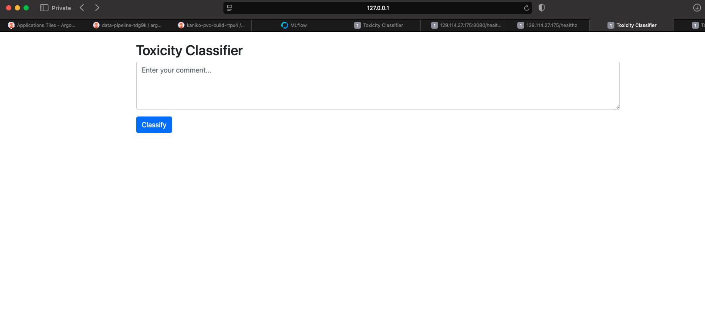

# Machine Learning System Operations - Final Project

## Content Moderation System / Toxicity Classifier

This project builds a complete machine learning system to operationalize a content moderation pipeline using the [Jigsaw Toxic Comment Classification dataset](https://www.kaggle.com/competitions/jigsaw-toxic-comment-classification-challenge/data). The goal is to not just train a classifier, but build a reproducible, cloud-native ML system with full DevOps, model lifecycle, evaluation, and deployment capabilities.

---

## Cloud Computing

### Infrastructure (Completed)

* **Provisioning:** Terraform provisions 3 `m1.xlarge` instances on ChameleonCloud.
* **Networking:** A private network is created and attached to a shared network, with a floating IP for access.
* **Storage:** A manually created block storage volume is mounted to Node 1 to persist data and artifacts.

* **[Terraform Code Dir](https://github.com/gauravkuwar/mlsysops-cms-iac/tree/d4b3df9b2e140e9f39d68446564b468cc1915285/tf/kvm)**: this is basically the same as the lab.

### Cloud-Native (Completed)

* **Kubernetes Cluster:**

  * Node 1: Control plane
  * Nodes 2 & 3: Worker nodes
* **Manual Selected K8s Dependencies:** K8s was installed without KubeSpray to control dependencies manually, but the installtion process is completed automated with ansible. ([Ansible Installation File Link](https://github.com/gauravkuwar/mlsysops-cms-iac/blob/d4b3df9b2e140e9f39d68446564b468cc1915285/ansible/k8s/k8s_install.yml))

**Kubernetes Cluster Nodes**


**Kubernetes Cluster Pods**


---

## DevOps

### Infrastructure as Code (Completed)

* A [Jupyter notebook](https://github.com/gauravkuwar/mlsysops-cms/blob/main/main.ipynb) walks through infrastructure setup, with high reproducibility.
* Ansible configures remote instances post-Terraform.

### Cloud-Native (Completed)

* GitOps via **Argo CD** to sync Kubernetes deployments with a Git repo.
* **Argo Workflows** defines and orchestrates data and ML pipelines.

### CI/CD and Continuous Training (Completed)

* **Kaniko** builds containers with cache and DAG parallelism.
* **[mlops-pipeline](https://github.com/gauravkuwar/mlsysops-cms-iac/blob/d4b3df9b2e140e9f39d68446564b468cc1915285/workflows/mlops-pipeline.yaml)** triggers mock training → offline evaluation → [ONNX optimization](https://github.com/gauravkuwar/mlsysops-cms-pipeline/blob/a86e09fc036f3f8750d9817ff5d9de7b082535a5/optimize/main.py) → staging load test → model promotion.

**Container Build Pipeline**


**MLOps Pipeline**


### [Staged Deployment](https://github.com/gauravkuwar/mlsysops-cms-iac/tree/d4b3df9b2e140e9f39d68446564b468cc1915285/k8s) (Completed)

* Four stages: **development**, **staging**, **canary**, **production**.
* Each stage has its own model served from a unique MLflow alias.

**ArgoCD Dashboard**


---

## Model Training at Scale

### Train and Re-train (Semi-Completed)

* Triggered via API.
* Currently uses a mock training pod; architecture supports GPU training.
* [Python File](https://github.com/gauravkuwar/mlsysops-cms-pipeline/blob/a86e09fc036f3f8750d9817ff5d9de7b082535a5/train/flow.py)


### Experiment Tracking (Completed)

* **MLflow** tracks all model runs, metrics, and artifacts.

**MLflow Jobs**


**MLflow Models**


---

## Model Serving

### Serving from an API Endpoint (Completed)

* Flask API serves ONNX models via ONNXRuntime.
* On boot, each stage loads the corresponding MLflow model.
* Periodic polling detects model updates and reloads dynamically.
* [App Repo](https://github.com/gauravkuwar/mlsysops-cms-app/tree/4c291c8da0e293729fb3e5807cde3e4cac047f36)

### Identify Requirements

* Requirements include:

  * Low-latency predictions (<100ms)
  * Batch throughput support
  * CPU-only inference under 512MB RAM
  * Support for concurrent requests (via gunicorn/async)

### Model Optimizations to Satisfy Requirements (Completed)

* Link to Jupyter Notebook: [https://github.com/gauravkuwar/mlsysops-cms-inference-optimization/blob/74830e8cc17e741ac079ae10a28c4028bb825c0f/model_optimizations.ipynb](https://github.com/gauravkuwar/mlsysops-cms-inference-optimization/blob/74830e8cc17e741ac079ae10a28c4028bb825c0f/model_optimizations.ipynb)

* Benchmarked PyTorch vs ONNX:

  * ✅ Graph optimization
  * ✅ Dynamic quantization
  * ✅ ONNXRuntime CPU + GPU tested

### 🧠 Inference Optimization Summary

| Model Variant               | Format      | Device         | Model Size | Accuracy | Latency (Median) | Throughput (FPS) | Batch Throughput (FPS) |
|----------------------------|-------------|----------------|------------|----------|------------------|------------------|------------------------|
| PyTorch (Eager)            | TorchScript | CPU            | 17.56 MB   | 92.02%   | 3.61 ms          | 270.66           | 1358.45                |
| PyTorch (Compiled)         | TorchScript | CPU            | 17.56 MB   | 92.02%   | 1.82 ms          | 540.00           | 2170.57                |
| ONNX (Base)                | ONNX        | CPU            | 17.61 MB   | 92.02%   | 1.16 ms          | 779.74           | 1980.38                |
| ONNX (Graph Optimized)     | ONNX        | CPU            | 17.61 MB   | 92.02%   | 1.47 ms          | 680.18           | 1466.31                |
| ONNX (Quantized - Dynamic) | ONNX        | CPU            | 4.51 MB    | 92.02%   | 1.52 ms          | 653.39           | 1767.16                |
| ONNX (Base)                | ONNX        | GPU (CUDA)     | 17.61 MB   | 92.02%   | 0.72 ms          | 1361.41          | 78767.20               |

### ✅ Key Takeaways
- **Quantization** reduced model size by ~75% with no accuracy drop.
- **ONNX with CUDA** gives the highest throughput (~78k FPS).
- **ONNX on CPU** (base) outperforms TorchScript in both latency and throughput.

### System Optimizations to Satisfy Requirements (Not Done)

* Optimizations such as async server, horizontal scaling, etc., are still pending.

### Multiple Serving Options (Completed)

* Compared PyTorch and ONNXRuntime
* ONNXRuntime chosen for speed and footprint

---

## Evaluation and Monitoring

### Offline Evaluation (Completed)

* Evaluates model on test split from preprocessed data
* Metrics: accuracy, F1-score
* Results logged to MLflow
* Python File Link - [https://github.com/gauravkuwar/mlsysops-cms-pipeline/blob/a86e09fc036f3f8750d9817ff5d9de7b082535a5/eval/flow.py](https://github.com/gauravkuwar/mlsysops-cms-pipeline/blob/a86e09fc036f3f8750d9817ff5d9de7b082535a5/eval/flow.py)

### Load Test in Staging (Completed)

* Load test hits `/predict` endpoint using `asyncio`
* Measures latency, throughput, and concurrency
* Used as gate to promote to canary
* Python File Link - [https://github.com/gauravkuwar/mlsysops-cms-pipeline/blob/a86e09fc036f3f8750d9817ff5d9de7b082535a5/loadtest/main.py](https://github.com/gauravkuwar/mlsysops-cms-pipeline/blob/a86e09fc036f3f8750d9817ff5d9de7b082535a5/loadtest/main.py)

```
[INFO] Waiting for /healthz to return version 30...
[READY] Model is now live in staging
[INFO] Starting load test: 50 users for 30s

--- Load Test Summary ---
Total requests: 616
Successes: 616, Failures: 0
Throughput: 20.53 req/s
P95 latency: 2.797s
Success rate: 100.00%
Result: PASS
🏃 View run load-test at: http://mlflow.mlsysops-cms-platform.svc.cluster.local:8000/#/experiments/0/runs/1b01aba0191d483b9018a0df367f4c68
🧪 View experiment at: http://mlflow.mlsysops-cms-platform.svc.cluster.local:8000/#/experiments/0
```

### Online Evaluation in Canary (Not Done)

* ...

### Close the Loop (Not Done)

* Initial Plan: Integrate with **Label Studio** for human feedback and retraining

### Define a Business-Specific Evaluation

* Proposed: Track false positives for flagged non-toxic comments
* Custom metric: false positive rate (FPR) at specific sensitivity thresholds

---

## Data Pipeline

### Persistent Storage (Completed)

* [Ansible to mount, format and organize presistant volume](https://github.com/gauravkuwar/mlsysops-cms-iac/blob/d4b3df9b2e140e9f39d68446564b468cc1915285/ansible/post_k8s/block_configure.yml)
* Mounted block storage on Node 1
* Organized directory structure.

### Offline Data (Completed)

* Data from Kaggle is downloaded, cleaned, tokenized, and split
* Stored for reuse across training and eval stages

### Data Pipelines (Completed)

* Defined as Argo Workflow
* Includes: ([Python File](https://github.com/gauravkuwar/mlsysops-cms-pipeline/blob/a86e09fc036f3f8750d9817ff5d9de7b082535a5/data/main.py))

  * Download from Kaggle
  * Preprocessing
  * Train/val/test split
  * Save to persistent storage


**Argo Workflow Data pipeline**


**Simple App UI**
